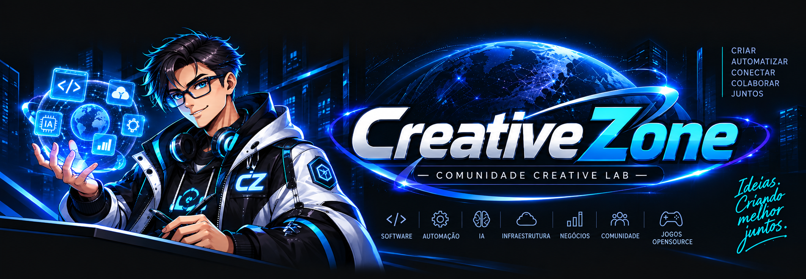
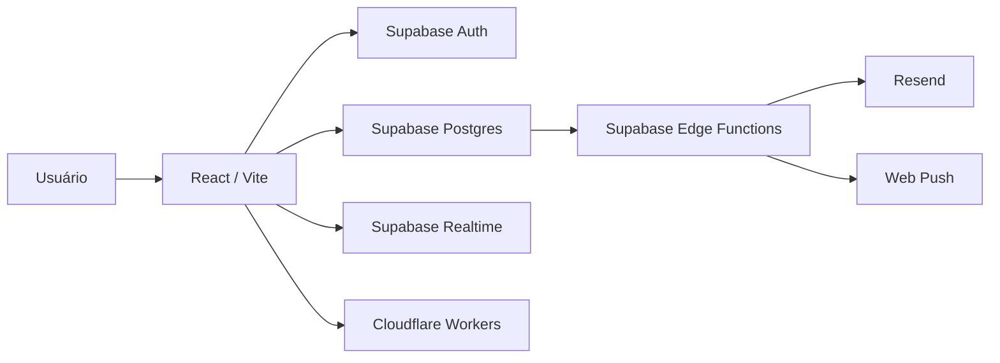

<p align="center">
  
</p>

<h1 align="center">CreativeZone</h1>

<p align="center">
  <strong>Um fórum comunitário para conversar, aprender, compartilhar conhecimento e construir projetos juntos.</strong>
</p>

<p align="center">
  <a href="https://assets-forum.gestao-quiroz.workers.dev/">🌐 Fórum</a>
  ·
  <a href="https://github.com/Creatiive-Lab">🧪 Creative Lab no GitHub</a>
</p>

<p align="center">
  
  
  
  
</p>

---

## Sobre a CreativeZone

A **CreativeZone** é uma comunidade voltada a tecnologia, desenvolvimento de software, automação, inteligência artificial, infraestrutura, hardware, games, negócios digitais e troca de conhecimento.

O projeto foi pensado para ir além de um fórum tradicional: uma discussão pode virar uma ideia, uma ideia pode virar um projeto e um projeto pode reunir membros de diferentes áreas para construir algo em conjunto.

Todos os membros da CreativeZone são bem-vindos para:

- criar e apresentar novos projetos;
- participar de projetos existentes;
- formar equipes e colaborar com outros membros;
- contribuir com código, documentação, design, testes, pesquisa e organização;
- compartilhar experiências, dúvidas e soluções;
- aprender construindo em comunidade.

Os projetos da comunidade também podem ganhar vida na organização **[Creatiive-Lab](https://github.com/Creatiive-Lab)** no GitHub.

---

## ✨ Principais recursos

### Fórum e comunidade

- categorias, tópicos e respostas persistidos no Supabase;
- perfis públicos com avatar, nome, bio, ocupação, localização opcional, interesses e links sociais;
- reações em tópicos e respostas;
- reputação e badges;
- sequência diária de acesso;
- favoritos salvos na conta;
- seguidores e seguindo;
- usuários ignorados;
- assinatura de fórum;
- citações com notificação específica;
- menções com `@usuario`;
- busca no fórum;
- tema claro e escuro;
- interface responsiva para desktop e mobile.

### Mensagens e notificações

- mensagens diretas entre membros;
- busca no histórico completo das conversas;
- notificações em tempo real;
- preferências individuais por evento;
- notificações no fórum;
- notificações por e-mail;
- Web Push para navegadores compatíveis;
- suporte a notificações em desktop e dispositivos móveis.

### Conta e segurança

- login por e-mail e senha;
- login com GitHub;
- login com Google;
- vinculação de identidades;
- alteração de e-mail;
- alteração de senha com reautenticação;
- gerenciamento de sessões e dispositivos;
- histórico de eventos da conta;
- desativação de conta;
- exclusão permanente de conta;
- privacidade de perfil;
- controle de mensagens diretas e seguidores;
- proteção de dados com Row Level Security;
- verificação gratuita de senhas comprometidas usando Have I Been Pwned.

---

## ✉️ E-mails com Resend

Os e-mails transacionais da CreativeZone são enviados pelo **Resend** através de Supabase Edge Functions.

Os templates seguem a identidade visual do fórum — preto, vermelho e a marca CreativeZone — e incluem HTML responsivo, versão em texto simples e botões de ação.

São personalizados e usados em fluxos como:

- recuperação de senha;
- Magic Link e códigos de segurança;
- alteração de e-mail;
- notificações de segurança;
- novas respostas;
- menções;
- citações;
- reações;
- novos seguidores;
- mensagens diretas;
- avisos da moderação.

> **Ambiente atual:** enquanto a CreativeZone ainda não possui domínio próprio para e-mail, o Resend opera em modo de desenvolvimento usando `onboarding@resend.dev`. A infraestrutura já está preparada para trocar o remetente quando um domínio próprio for configurado.

---

## 🔔 Web Push / PWA

A aplicação possui:

- Service Worker;
- Web App Manifest;
- registro de dispositivos;
- subscriptions via Push API;
- notificações acionadas por eventos do fórum;
- abertura direta da rota relevante ao clicar na notificação.

Em iOS/Safari, Web Push depende da instalação do site na Tela de Início e da permissão concedida pelo usuário.

---

## 🧱 Stack

| Camada | Tecnologia |
|---|---|
| Interface | React + Vite |
| Ícones | Lucide React |
| Tipografia | DM Sans |
| Backend | Supabase |
| Banco | PostgreSQL |
| Autenticação | Supabase Auth |
| Realtime | Supabase Realtime |
| Segurança | RLS + policies + RPCs |
| E-mail | Resend + Supabase Edge Functions |
| Push | Service Worker + Web Push |
| Hospedagem | Cloudflare Workers Static Assets |
| CI | GitHub Actions |

---

## 🏗️ Arquitetura



---

## 🚀 Executar localmente

### 1. Clone o repositório

```bash
git clone https://github.com/Inosuke-Company/CreativeZone.git
cd CreativeZone
```

### 2. Instale as dependências

```bash
npm install
```

ou, para uma instalação reproduzível usando o lockfile:

```bash
npm ci
```

### 3. Configure as variáveis do frontend

Crie um arquivo `.env.local`:

```env
VITE_SUPABASE_URL=https://SEU-PROJETO.supabase.co
VITE_SUPABASE_PUBLISHABLE_KEY=sb_publishable_xxxxx
```

Por compatibilidade, o projeto também aceita:

```env
VITE_SUPABASE_ANON_KEY=eyJ...
```

> Nunca coloque `service_role`, chaves secretas do Supabase, API keys do Resend, VAPID private key ou qualquer outro segredo em variáveis `VITE_*`. Tudo que começa com `VITE_` pode ser enviado ao navegador.

### 4. Inicie o ambiente de desenvolvimento

```bash
npm run dev
```

---

## 🔐 Secrets do backend

Credenciais privadas usadas pelas Edge Functions devem ser configuradas em **Supabase → Edge Functions → Secrets**.

Exemplos usados pelo projeto:

```text
RESEND_API_KEY
RESEND_FROM
SEND_EMAIL_HOOK_SECRET
```

Outros segredos internos, como credenciais de Web Push, devem permanecer exclusivamente no backend/Vault.

---

## ⚡ Supabase

As migrations ficam em:

```text
supabase/migrations/
```

As Edge Functions ficam em:

```text
supabase/functions/
├── delete-account/
├── send-auth-email/
├── send-community-email/
└── send-push/
```

A aplicação depende de políticas RLS e funções/RPCs do banco para aplicar permissões e regras de segurança.

---

## 📁 Estrutura principal

```text
CreativeZone/
├── assets/                    # banners, logo e imagens
├── public/
│   ├── manifest.webmanifest  # PWA
│   └── sw.js                 # Service Worker / Web Push
├── src/
│   ├── hooks/
│   ├── services/
│   ├── AdvancedAccountSections.jsx
│   ├── CommunityPages.jsx
│   ├── main.jsx
│   └── styles.css
├── supabase/
│   ├── functions/
│   └── migrations/
├── package.json
├── vite.config.js
└── wrangler.jsonc
```

---

## 🛠️ Build

```bash
npm run build
```

O Vite gera a versão de produção em:

```text
dist/
```

O Cloudflare Workers Static Assets serve esse diretório e utiliza comportamento SPA para rotas internas.

---

## ☁️ Deploy

O fluxo atual é:

```text
push no main
   ↓
GitHub Actions
   ↓
build do Vite
   ↓
Cloudflare Workers Static Assets
```

A aplicação pública está disponível em:

**https://assets-forum.gestao-quiroz.workers.dev/**

---

## 🤝 Projetos e colaboração

A CreativeZone foi criada para ser uma comunidade de participação ativa.

Você não precisa ser especialista para contribuir. Se tiver uma ideia, proponha. Se encontrar um projeto interessante, participe. Se souber programar, programe. Se souber desenhar, documentar, testar, pesquisar ou organizar, sua contribuição também é valiosa.

Projetos comunitários podem ser desenvolvidos na organização:

### **[github.com/Creatiive-Lab](https://github.com/Creatiive-Lab)**

A proposta é simples:

> **compartilhar conhecimento, criar juntos e transformar boas ideias em projetos reais.**

---

## 🗺️ Próximos passos

- domínio próprio da CreativeZone;
- domínio de envio verificado no Resend;
- remetentes de produção para autenticação e notificações;
- evolução contínua das ferramentas comunitárias;
- novos projetos colaborativos na Creative Lab.

---

<p align="center">
  <strong>CreativeZone</strong><br/>
  Ideias. Tecnologia. Comunidade. Projetos construídos juntos.
</p>
